# P06 Architecture — SAST & DAST Correlation Engine
## Complete System Design with Mermaid Diagrams

> **Mitigata Hackathon — Problem 06 · Flagship**  
> Three Objectives: Scan Code+App · Correlate+Merge · Prioritise  
> Real Incident: INC-06 — 2017 Credit Bureau Breach (~145M records)  
> PRD: [P06-PRD.md](P06-PRD.md) — source of truth  
> Architecture version: 1.3 — multi-target Flask/Express route mapping and strict correlation

---

## Table of Contents

1. [System Overview](#1-system-overview)
2. [Container Architecture](#2-container-architecture)
3. [End-to-End Data Flow](#3-end-to-end-data-flow)
4. [Component Deep-Dives](#4-component-deep-dives)
   - 4.1 [Ingestion Pipeline — FR-1, FR-2, FR-3](#41-ingestion-pipeline--fr-1-fr-2-fr-3)
   - 4.2 [Three-Pass AST Route Mapper — FR-4](#42-three-pass-ast-route-mapper--fr-4)
   - 4.3 [Correlation & Merge Engine — FR-5, FR-6](#43-correlation--merge-engine--fr-5-fr-6)
   - 4.4 [LangGraph Verification Loop — B-1](#44-langgraph-verification-loop--b-1)
   - 4.5 [3-Label Classifier — FR-7, FR-9](#45-3-label-classifier--fr-7-fr-9)
   - 4.6 [Patch Engine — B-4](#46-patch-engine--b-4)
   - 4.7 [Compliance Translator](#47-compliance-translator)
   - 4.8 [FastAPI Engine Layer — FR-10](#48-fastapi-engine-layer--fr-10)
   - 4.9 [React Frontend — FR-8, FR-9](#49-react-frontend--fr-8-fr-9)
5. [Network Topology](#5-network-topology)
6. [Data Schemas](#6-data-schemas)
7. [API Contract](#7-api-contract)
8. [Answer Key Mapping](#8-answer-key-mapping)
9. [Performance Budget](#9-performance-budget)
10. [Dependency Graph](#10-dependency-graph)

---

## 1. System Overview

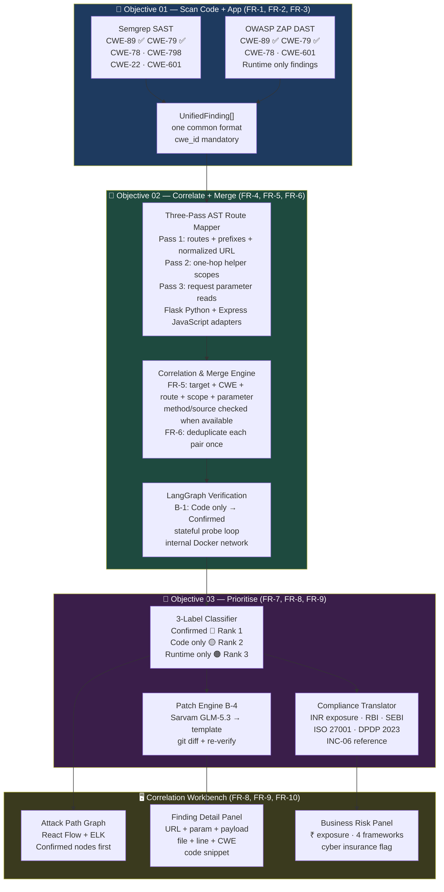
```mermaid
flowchart TD
    subgraph OBJ1["🎯 Objective 01 — Scan Code + App (FR-1, FR-2, FR-3)"]
        SAST["Semgrep SAST\nCWE-89 ✅ CWE-79 ✅\nCWE-78 · CWE-798\nCWE-22 · CWE-601"]
        DAST["OWASP ZAP DAST\nCWE-89 ✅ CWE-79 ✅\nCWE-78 · CWE-601\nRuntime only findings"]
        UF["UnifiedFinding[]\none common format\ncwe_id mandatory"]
        SAST --> UF
        DAST --> UF
    end

    subgraph OBJ2["🎯 Objective 02 — Correlate + Merge (FR-4, FR-5, FR-6)"]
        AST["Three-Pass AST Route Mapper\nPass 1: routes + prefixes + normalized URL\nPass 2: one-hop helper scopes\nPass 3: request parameter reads\nFlask Python + Express JavaScript adapters"]
        CORR["Correlation & Merge Engine\nFR-5: target + CWE + route + scope + parameter\nmethod/source checked when available\nFR-6: deduplicate each pair once"]
        LG["LangGraph Verification\nB-1: Code only → Confirmed\nstateful probe loop\ninternal Docker network"]
        UF --> AST
        AST --> CORR
        CORR --> LG
    end

    subgraph OBJ3["🎯 Objective 03 — Prioritise (FR-7, FR-8, FR-9)"]
        CLS["3-Label Classifier\nConfirmed 🔴 Rank 1\nCode only 🟡 Rank 2\nRuntime only 🟠 Rank 3"]
        PATCH["Patch Engine B-4\nSarvam GLM-5.3 → template\ngit diff + re-verify"]
        COMP["Compliance Translator\nINR exposure · RBI · SEBI\nISO 27001 · DPDP 2023\nINC-06 reference"]
        LG --> CLS
        CLS --> PATCH
        CLS --> COMP
    end

    subgraph UI["🖥️ Correlation Workbench (FR-8, FR-9, FR-10)"]
        GRAPH["Attack Path Graph\nReact Flow + ELK\nConfirmed nodes first"]
        DETAIL["Finding Detail Panel\nURL + param + payload\nfile + line + CWE\ncode snippet"]
        RISK["Business Risk Panel\n₹ exposure · 4 frameworks\ncyber insurance flag"]
        CLS --> GRAPH
        PATCH --> DETAIL
        COMP --> RISK
    end

    style OBJ1 fill:#1e3a5f,color:#fff
    style OBJ2 fill:#1e4a3f,color:#fff
    style OBJ3 fill:#3a1e4a,color:#fff
    style UI fill:#3a3a1e,color:#fff
```

---

## 2. Container Architecture

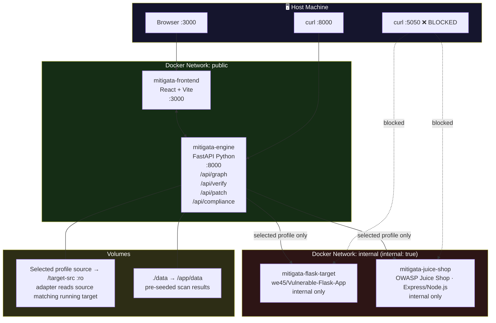
```mermaid
graph TB
    subgraph HOST["🖥️ Host Machine"]
        BROWSER["Browser :3000"]
        CURL["curl :8000"]
        BLOCKED["curl :5050 ❌ BLOCKED"]
    end

    subgraph PUBLIC["Docker Network: public"]
        FE["mitigata-frontend\nReact + Vite\n:3000"]
        ENG["mitigata-engine\nFastAPI Python\n:8000\n/api/graph\n/api/verify\n/api/patch\n/api/compliance"]
    end

    subgraph INTERNAL["Docker Network: internal (internal: true)"]
        TARGET["mitigata-flask-target\nwe45/Vulnerable-Flask-App\ninternal only"]
        JUICE["mitigata-juice-shop\nOWASP Juice Shop · Express/Node.js\ninternal only"]
    end

    subgraph VOLUMES["Volumes"]
        SRC["Selected profile source → /target-src :ro\nadapter reads source matching running target"]
        DATA["./data → /app/data\npre-seeded scan results"]
    end

    BROWSER --> FE
    CURL --> ENG
    BLOCKED -. "blocked" .-> TARGET
    BLOCKED -. "blocked" .-> JUICE
    FE <--> ENG
    ENG -->|"selected profile only"| TARGET
    ENG -->|"selected profile only"| JUICE
    ENG --- SRC
    ENG --- DATA

    style INTERNAL fill:#2d1515,color:#fff
    style PUBLIC fill:#152d15,color:#fff
    style HOST fill:#15152d,color:#fff
    style VOLUMES fill:#2d2d15,color:#fff
```

> **Security invariant:** `mitigata-target` is reachable **only** from `mitigata-engine` via the internal Docker network. All LangGraph probes route through the engine. No external traffic ever leaves the Docker network.

---

## 3. End-to-End Data Flow

### 3.1 Full Pipeline — Startup to Classified Findings

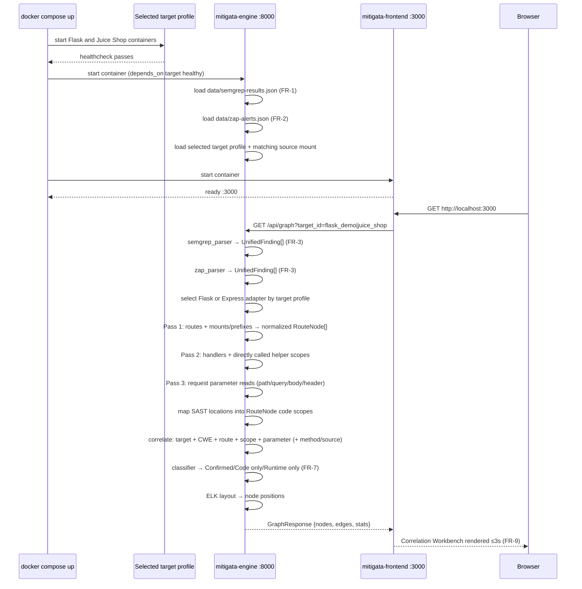
```mermaid
sequenceDiagram
    participant DC as docker compose up
    participant T as Selected target profile
    participant E as mitigata-engine :8000
    participant FE as mitigata-frontend :3000
    participant B as Browser

    DC->>T: start Flask and Juice Shop containers
    T-->>DC: healthcheck passes
    DC->>E: start container (depends_on target healthy)
    E->>E: load data/semgrep-results.json (FR-1)
    E->>E: load data/zap-alerts.json (FR-2)
    E->>E: load selected target profile + matching source mount
    DC->>FE: start container
    FE-->>DC: ready :3000

    B->>FE: GET http://localhost:3000
    FE->>E: GET /api/graph?target_id=flask_demo|juice_shop
    E->>E: semgrep_parser → UnifiedFinding[] (FR-3)
    E->>E: zap_parser → UnifiedFinding[] (FR-3)
    E->>E: select Flask or Express adapter by target profile
    E->>E: Pass 1: routes + mounts/prefixes → normalized RouteNode[]
    E->>E: Pass 2: handlers + directly called helper scopes
    E->>E: Pass 3: request parameter reads (path/query/body/header)
    E->>E: map SAST locations into RouteNode code scopes
    E->>E: correlate: target + CWE + route + scope + parameter (+ method/source)
    E->>E: classifier → Confirmed/Code only/Runtime only (FR-7)
    E->>E: ELK layout → node positions
    E-->>FE: GraphResponse {nodes, edges, stats}
    FE-->>B: Correlation Workbench rendered ≤3s (FR-9)
```

### 3.2 Live Verification Flow — B-1 (Code only → Confirmed)

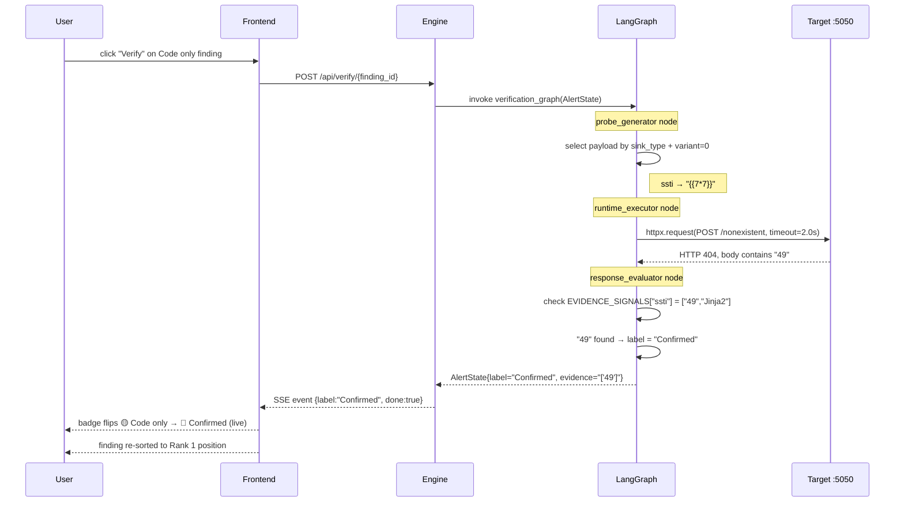
```mermaid
sequenceDiagram
    participant U as User
    participant FE as Frontend
    participant E as Engine
    participant LG as LangGraph
    participant T as Target :5050

    U->>FE: click "Verify" on Code only finding
    FE->>E: POST /api/verify/{finding_id}
    E->>LG: invoke verification_graph(AlertState)

    Note over LG: probe_generator node
    LG->>LG: select payload by sink_type + variant=0
    Note right of LG: ssti → "{{7*7}}"

    Note over LG: runtime_executor node
    LG->>T: httpx.request(POST /nonexistent, timeout=2.0s)
    T-->>LG: HTTP 404, body contains "49"

    Note over LG: response_evaluator node
    LG->>LG: check EVIDENCE_SIGNALS["ssti"] = ["49","Jinja2"]
    LG->>LG: "49" found → label = "Confirmed"

    LG-->>E: AlertState{label="Confirmed", evidence="['49']"}
    E-->>FE: SSE event {label:"Confirmed", done:true}
    FE-->>U: badge flips 🟡 Code only → 🔴 Confirmed (live)
    FE-->>U: finding re-sorted to Rank 1 position
```

### 3.3 Conditional Retry Flow

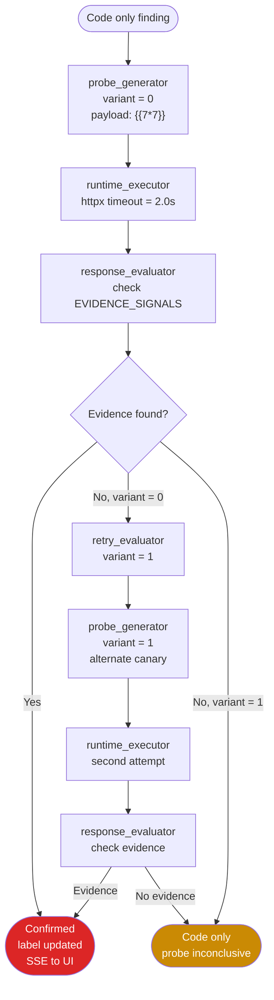
```mermaid
flowchart TD
    START(["Code only finding"]) --> PG["probe_generator<br/>variant = 0<br/>payload: {{7*7}}"]
    PG --> RE["runtime_executor<br/>httpx timeout = 2.0s"]
    RE --> EV["response_evaluator<br/>check EVIDENCE_SIGNALS"]

    EV --> DEC{"Evidence found?"}
    DEC -->|Yes| CONFIRMED(["Confirmed<br/>label updated<br/>SSE to UI"])
    DEC -->|No, variant = 0| RETRY["retry_evaluator<br/>variant = 1"]
    DEC -->|No, variant = 1| CODEONLY(["Code only<br/>probe inconclusive"])

    RETRY --> PG2["probe_generator<br/>variant = 1<br/>alternate canary"]
    PG2 --> RE2["runtime_executor<br/>second attempt"]
    RE2 --> EV2["response_evaluator<br/>check evidence"]
    EV2 -->|Evidence| CONFIRMED
    EV2 -->|No evidence| CODEONLY

    style CONFIRMED fill:#dc2626,color:#fff
    style CODEONLY fill:#ca8a04,color:#fff
```

### 3.4 Auto-Remediation Flow — B-4

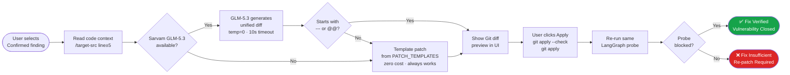
```mermaid
flowchart LR
    SEL([User selects\nConfirmed finding]) --> CTX[Read code context\n/target-src line±5]
    CTX --> SARVAM{Sarvam GLM-5.3\navailable?}
    SARVAM -->|Yes| LLM[GLM-5.3 generates\nunified diff\ntemp=0 · 10s timeout]
    SARVAM -->|No| TPL[Template patch\nfrom PATCH_TEMPLATES\nzero cost · always works]

    LLM --> VALID{Starts with\n--- or @@?}
    VALID -->|Yes| DIFF[Show Git diff\npreview in UI]
    VALID -->|No| TPL
    TPL --> DIFF

    DIFF --> APPLY[User clicks Apply\ngit apply --check\ngit apply]
    APPLY --> REVERIFY[Re-run same\nLangGraph probe]
    REVERIFY --> RESULT{Probe\nblocked?}
    RESULT -->|Yes| FIXED([✅ Fix Verified\nVulnerability Closed])
    RESULT -->|No| INSUFF([❌ Fix Insufficient\nRe-patch Required])

    style FIXED fill:#16a34a,color:#fff
    style INSUFF fill:#dc2626,color:#fff
```

---

## 4. Component Deep-Dives

### 4.1 Ingestion Pipeline — FR-1, FR-2, FR-3

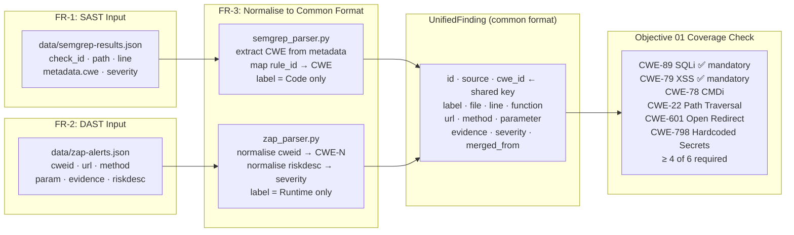
```mermaid
flowchart LR
    subgraph SAST_IN["FR-1: SAST Input"]
        SJ["data/semgrep-results.json\ncheck_id · path · line\nmetadata.cwe · severity"]
    end

    subgraph DAST_IN["FR-2: DAST Input"]
        ZJ["data/zap-alerts.json\ncweid · url · method\nparam · evidence · riskdesc"]
    end

    subgraph PARSE["FR-3: Normalise to Common Format"]
        SP["semgrep_parser.py\nextract CWE from metadata\nmap rule_id → CWE\nlabel = Code only"]
        ZP["zap_parser.py\nnormalise cweid → CWE-N\nnormalise riskdesc → severity\nlabel = Runtime only"]
    end

    subgraph OUT["UnifiedFinding (common format)"]
        UF["id · source · cwe_id ← shared key\nlabel · file · line · function\nurl · method · parameter\nevidence · severity · merged_from"]
    end

    subgraph COV["Objective 01 Coverage Check"]
        CHECK["CWE-89 SQLi ✅ mandatory\nCWE-79 XSS ✅ mandatory\nCWE-78 CMDi\nCWE-22 Path Traversal\nCWE-601 Open Redirect\nCWE-798 Hardcoded Secrets\n≥ 4 of 6 required"]
    end

    SJ --> SP --> UF
    ZJ --> ZP --> UF
    UF --> CHECK
```

### 4.2 Three-Pass AST Route Mapper — FR-4

FR-4 is a **must-have** requirement: *"read the source code to list which URL is handled by which function and lines"*. A profile selects either the Flask/Python adapter or Express/JavaScript adapter; both emit the same `RouteNode` contract. Route identity, source scope, and observed request keys are collected separately so a matching line range alone cannot establish correlation. Every route and finding carries `target_id`, preventing evidence from separate applications from joining.

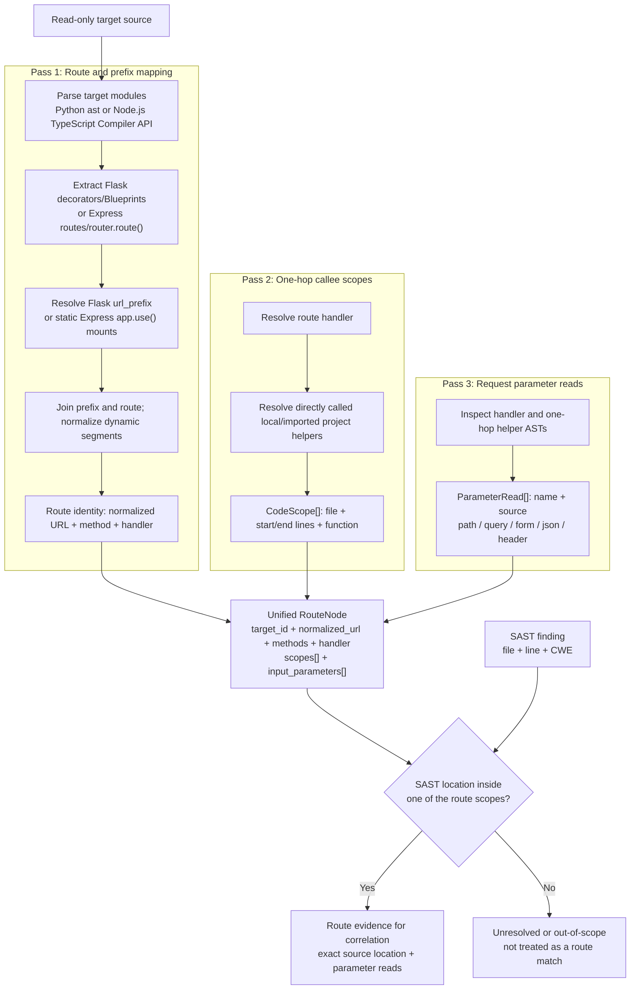
```mermaid
flowchart TD
    SRC["Read-only target source"]

    subgraph P1["Pass 1: Route and prefix mapping"]
        PARSE["Parse target modules\nPython ast or Node.js TypeScript Compiler API"]
        DECL["Extract Flask decorators/Blueprints\nor Express routes/router.route()"]
        PREFIX["Resolve Flask url_prefix\nor static Express app.use() mounts"]
        NORMAL["Join prefix and route; normalize dynamic segments"]
        R1["Route identity: normalized URL + method + handler"]
        PARSE --> DECL --> PREFIX --> NORMAL --> R1
    end

    subgraph P2["Pass 2: One-hop callee scopes"]
        HANDLER["Resolve route handler"]
        CALLEE["Resolve directly called local/imported project helpers"]
        SCOPES["CodeScope[]: file + start/end lines + function"]
        HANDLER --> CALLEE --> SCOPES
    end

    subgraph P3["Pass 3: Request parameter reads"]
        READ["Inspect handler and one-hop helper ASTs"]
        PARAMS["ParameterRead[]: name + source\npath / query / form / json / header"]
        READ --> PARAMS
    end

    NODE["Unified RouteNode\ntarget_id + normalized_url + methods + handler\nscopes[] + input_parameters[]"]
    SAST["SAST finding\nfile + line + CWE"]
    SCOPE_MATCH{"SAST location inside\none of the route scopes?"}
    OUT["Route evidence for correlation\nexact source location + parameter reads"]
    UNMATCHED["Unresolved or out-of-scope\nnot treated as a route match"]

    SRC --> PARSE
    R1 --> NODE
    SCOPES --> NODE
    PARAMS --> NODE
    NODE --> SCOPE_MATCH
    SAST --> SCOPE_MATCH
    SCOPE_MATCH -->|Yes| OUT
    SCOPE_MATCH -->|No| UNMATCHED
```

**Example RouteNode after all passes:** A Flask Blueprint mounted at `/api`,
with `@bp.route("/orders/<int:id>")`, resolves to `/api/orders/{param}`. An
Express router mounted with a static `app.use("/api", router)` prefix and a
`router.get("/orders/:id", ...)` declaration resolves to the same template.
Each adapter records its target ID, statically named request reads (such as
`request.args.get("q")` or `req.query.q`), and handler/direct-helper code scopes.
Pass 2 is intentionally one hop in v1; transitive call chains are not claimed
as resolved. Dynamic or unresolved mount paths stay explicitly unresolved.

### 4.3 Correlation & Merge Engine — FR-5, FR-6

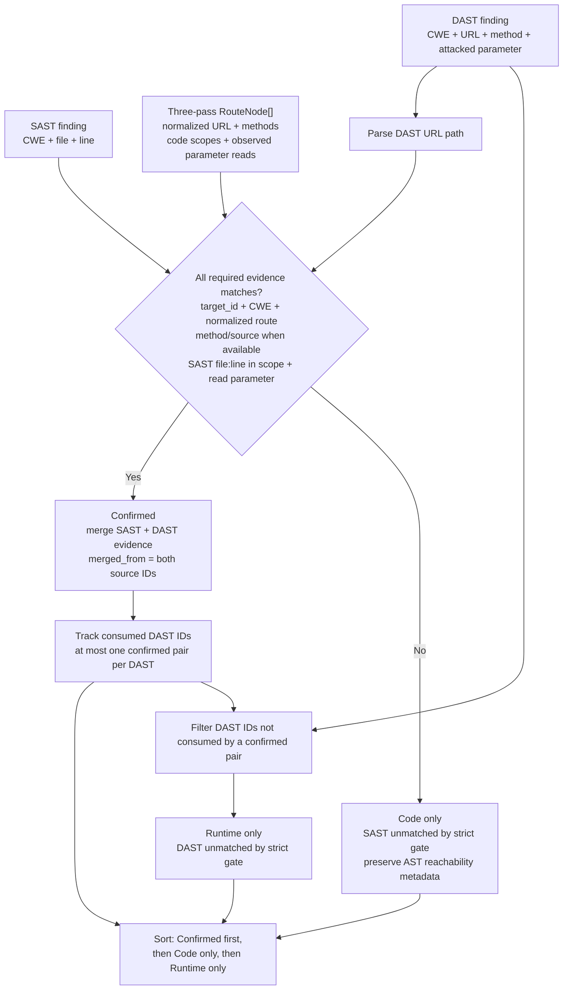
```mermaid
flowchart TD
    SAST["SAST finding\nCWE + file + line"]
    DAST["DAST finding\nCWE + URL + method + attacked parameter"]
    ROUTES["Three-pass RouteNode[]\nnormalized URL + methods\ncode scopes + observed parameter reads"]

    PATH["Parse DAST URL path"]
    MATCH{"All required evidence matches?\ntarget_id + CWE + normalized route\nmethod/source when available\nSAST file:line in scope + read parameter"}
    CONFIRMED["Confirmed\nmerge SAST + DAST evidence\nmerged_from = both source IDs"]
    CODE["Code only\nSAST unmatched by strict gate\npreserve AST reachability metadata"]
    RUNTIME["Runtime only\nDAST unmatched by strict gate"]
    DEDUP["Track consumed DAST IDs\nat most one confirmed pair per DAST"]
    SORT["Sort: Confirmed first,\nthen Code only, then Runtime only"]
    LEFT["Filter DAST IDs not consumed by a confirmed pair"]

    SAST --> MATCH
    DAST --> PATH --> MATCH
    ROUTES --> MATCH
    MATCH -->|Yes| CONFIRMED --> DEDUP --> SORT
    MATCH -->|No| CODE --> SORT
    DAST --> LEFT
    DEDUP --> LEFT
    LEFT --> RUNTIME --> SORT
```

The correlation gate is conjunctive: target ID, CWE, route, scope, and attacked
parameter must match; method and parameter source must match when supplied. A
CWE-only or route-only match is not enough to label a pair Confirmed. Findings
and routes with different `target_id` values never correlate. Unresolved route mounts, missing SAST
locations, dynamic request keys, or absent parameter evidence remain unmatched.
Each DAST finding can be consumed by at most one SAST finding in a run.

### 4.4 LangGraph Verification Loop — B-1

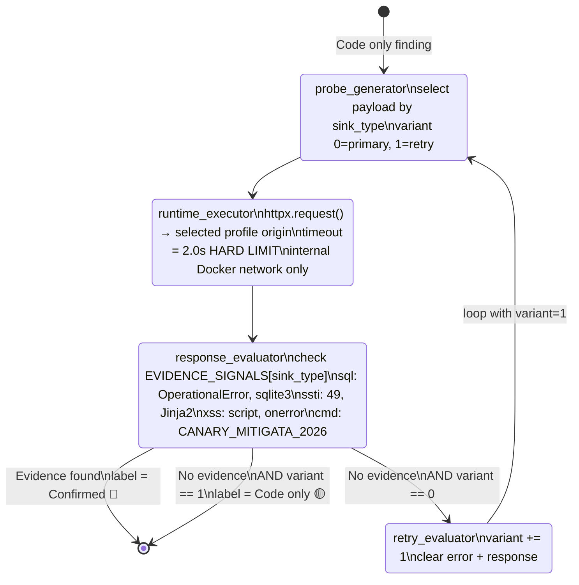
```mermaid
stateDiagram-v2
    [*] --> probe_generator : Code only finding

    probe_generator : probe_generator\nselect payload by sink_type\nvariant 0=primary, 1=retry

    runtime_executor : runtime_executor\nhttpx.request() → selected profile origin\ntimeout = 2.0s HARD LIMIT\ninternal Docker network only

    response_evaluator : response_evaluator\ncheck EVIDENCE_SIGNALS[sink_type]\nsql: OperationalError, sqlite3\nssti: 49, Jinja2\nxss: script, onerror\ncmd: CANARY_MITIGATA_2026

    retry_evaluator : retry_evaluator\nvariant += 1\nclear error + response

    probe_generator --> runtime_executor
    runtime_executor --> response_evaluator

    response_evaluator --> [*] : Evidence found\nlabel = Confirmed 🔴
    response_evaluator --> retry_evaluator : No evidence\nAND variant == 0
    response_evaluator --> [*] : No evidence\nAND variant == 1\nlabel = Code only 🟡

    retry_evaluator --> probe_generator : loop with variant=1
```

**Probe safety constraints:**
- ✅ Canary strings only — never `DROP TABLE`, never OS commands
- ✅ Internal Docker network only — no external traffic
- ✅ 2.0s hard timeout — never blocks demo
- ✅ Probes only on SAST-flagged routes — no spider/crawl
- ✅ `probe_history` records all attempts for UI audit trail

### 4.5 3-Label Classifier — FR-7, FR-9

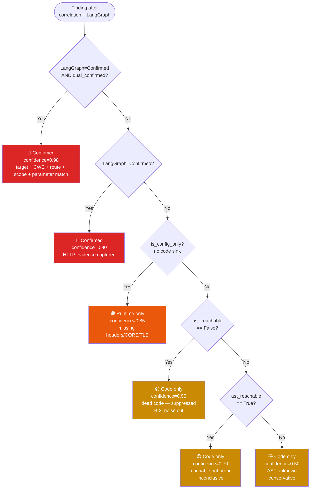
```mermaid
flowchart TD
    INPUT([Finding after\ncorrelation + LangGraph]) --> R1

    R1{LangGraph=Confirmed\nAND dual_confirmed?}
    R1 -->|Yes| C1["🔴 Confirmed\nconfidence=0.98\ntarget + CWE + route + scope + parameter match"]

    R1 -->|No| R2
    R2{LangGraph=Confirmed?}
    R2 -->|Yes| C2["🔴 Confirmed\nconfidence=0.90\nHTTP evidence captured"]

    R2 -->|No| R3
    R3{is_config_only?\nno code sink}
    R3 -->|Yes| C3["🟠 Runtime only\nconfidence=0.85\nmissing headers/CORS/TLS"]

    R3 -->|No| R4
    R4{ast_reachable\n== False?}
    R4 -->|Yes| C4["🟡 Code only\nconfidence=0.95\ndead code — suppressed\nB-2: noise cut"]

    R4 -->|No| R5
    R5{ast_reachable\n== True?}
    R5 -->|Yes| C5["🟡 Code only\nconfidence=0.70\nreachable but probe\ninconclusive"]

    R5 -->|No| C6["🟡 Code only\nconfidence=0.50\nAST unknown\nconservative"]

    style C1 fill:#dc2626,color:#fff
    style C2 fill:#dc2626,color:#fff
    style C3 fill:#ea580c,color:#fff
    style C4 fill:#ca8a04,color:#fff
    style C5 fill:#ca8a04,color:#fff
    style C6 fill:#ca8a04,color:#fff
```

### 4.6 Patch Engine — B-4

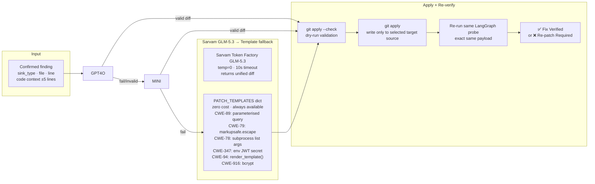
```mermaid
flowchart LR
    subgraph INPUT["Input"]
        FIND["Confirmed finding\nsink_type · file · line\ncode context ±5 lines"]
    end

    subgraph CHAIN["Sarvam GLM-5.3 → Template fallback"]
        SARVAM["Sarvam Token Factory GLM-5.3\ntemp=0 · 10s timeout\nreturns unified diff"]
        TPL["PATCH_TEMPLATES dict\nzero cost · always available\nCWE-89: parameterised query\nCWE-79: markupsafe.escape\nCWE-78: subprocess list args\nCWE-347: env JWT secret\nCWE-94: render_template()\nCWE-916: bcrypt"]
    end

    subgraph APPLY["Apply + Re-verify"]
        CHECK["git apply --check\ndry-run validation"]
        APPLY2["git apply\nwrite only to selected target source"]
        REVERIFY["Re-run same LangGraph probe\nexact same payload"]
        RESULT["✅ Fix Verified\nor ❌ Re-patch Required"]
    end

    FIND --> GPT4O
    GPT4O -->|valid diff| CHECK
    GPT4O -->|fail/invalid| MINI
    MINI -->|valid diff| CHECK
    MINI -->|fail| TPL
    TPL --> CHECK
    CHECK --> APPLY2 --> REVERIFY --> RESULT
```

### 4.7 Compliance Translator

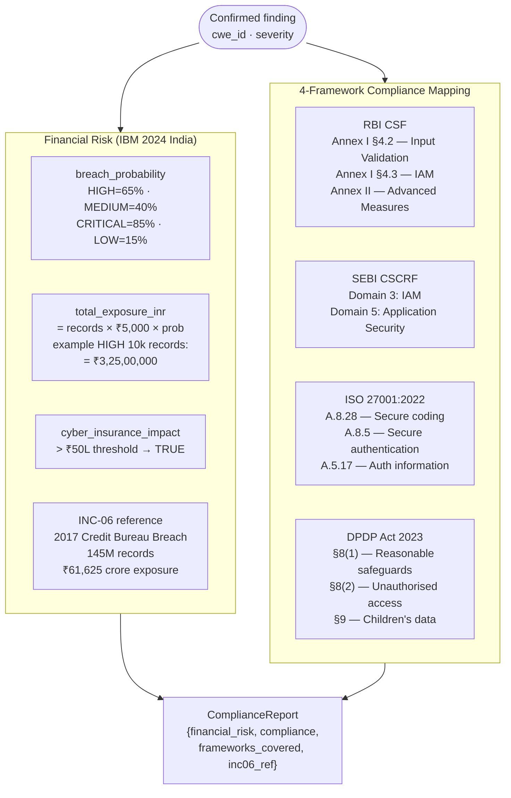
```mermaid
flowchart TD
    FIND([Confirmed finding\ncwe_id · severity]) --> RISK & MAP

    subgraph RISK["Financial Risk (IBM 2024 India)"]
        PROB["breach_probability\nHIGH=65% · MEDIUM=40%\nCRITICAL=85% · LOW=15%"]
        EXP["total_exposure_inr\n= records × ₹5,000 × prob\nexample HIGH 10k records:\n= ₹3,25,00,000"]
        INS["cyber_insurance_impact\n> ₹50L threshold → TRUE"]
        INC06["INC-06 reference\n2017 Credit Bureau Breach\n145M records\n₹61,625 crore exposure"]
    end

    subgraph MAP["4-Framework Compliance Mapping"]
        RBI["RBI CSF\nAnnex I §4.2 — Input Validation\nAnnex I §4.3 — IAM\nAnnex II — Advanced Measures"]
        SEBI["SEBI CSCRF\nDomain 3: IAM\nDomain 5: Application Security"]
        ISO["ISO 27001:2022\nA.8.28 — Secure coding\nA.8.5 — Secure authentication\nA.5.17 — Auth information"]
        DPDP["DPDP Act 2023\n§8(1) — Reasonable safeguards\n§8(2) — Unauthorised access\n§9 — Children's data"]
    end

    RISK --> OUT
    MAP --> OUT
    OUT["ComplianceReport\n{financial_risk, compliance,\nframeworks_covered, inc06_ref}"]
```

### 4.8 FastAPI Engine Layer — FR-10

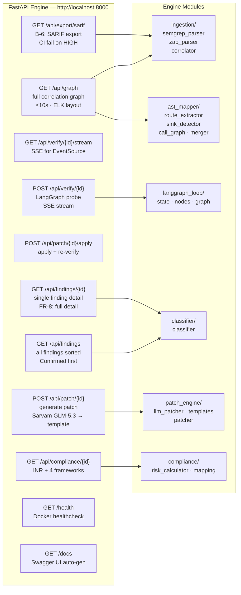
```mermaid
graph LR
    subgraph API["FastAPI Engine — http://localhost:8000"]
        G["GET /api/graph\nfull correlation graph\n≤10s · ELK layout"]
        V["POST /api/verify/{id}\nLangGraph probe\nSSE stream"]
        VS["GET /api/verify/{id}/stream\nSSE for EventSource"]
        P["POST /api/patch/{id}\ngenerate patch\nSarvam GLM-5.3 → template"]
        PA["POST /api/patch/{id}/apply\napply + re-verify"]
        C["GET /api/compliance/{id}\nINR + 4 frameworks"]
        F["GET /api/findings\nall findings sorted\nConfirmed first"]
        FI["GET /api/findings/{id}\nsingle finding detail\nFR-8: full detail"]
        SAR["GET /api/export/sarif\nB-6: SARIF export\nCI fail on HIGH"]
        H["GET /health\nDocker healthcheck"]
        D["GET /docs\nSwagger UI auto-gen"]
    end

    subgraph MODULES["Engine Modules"]
        ING["ingestion/\nsemgrep_parser\nzap_parser\ncorrelator"]
        AST["ast_mapper/\nroute_extractor\nsink_detector\ncall_graph · merger"]
        LGM["langgraph_loop/\nstate · nodes · graph"]
        CLF["classifier/\nclassifier"]
        PCH["patch_engine/\nllm_patcher · templates\npatcher"]
        CMP["compliance/\nrisk_calculator · mapping"]
    end

    G --> ING & AST
    V --> LGM
    P --> PCH
    C --> CMP
    F & FI --> CLF
    SAR --> ING
```

### 4.9 React Frontend — FR-8, FR-9

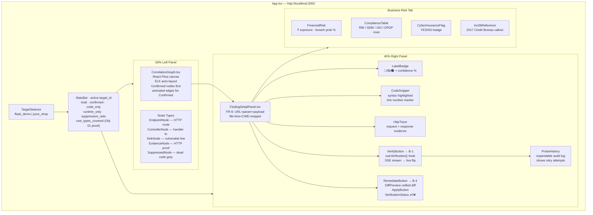
```mermaid
graph TD
    subgraph APP["App.tsx — http://localhost:3000"]
        TS["TargetSelector\nflask_demo | juice_shop"]
        SB["StatsBar · active target_id\ntotal · confirmed · code_only\nruntime_only · suppression_ratio\ncwe_types_covered (Obj 01 proof)"]

        subgraph LEFT["60% Left Panel"]
            CG["CorrelationGraph.tsx\nReact Flow canvas\nELK auto-layout\nConfirmed nodes first\nanimated edges for Confirmed"]
            NT["Node Types\nEndpointNode — HTTP route\nControllerNode — handler fn\nSinkNode — vulnerable line\nEvidenceNode — HTTP proof\nSuppressedNode — dead code grey"]
        end

        subgraph RIGHT["40% Right Panel"]
            DP["FindingDetailPanel.tsx\nFR-8: URL+param+payload\nfile+line+CWE+snippet"]
            LB["LabelBadge\n🔴/🟡/🟠 + confidence %"]
            CS["CodeSnippet\nsyntax highlighted\nline number marker"]
            HT["HttpTrace\nrequest + response evidence"]
            VB["VerifyButton → B-1\nuseVerification() hook\nSSE stream → live flip"]
            PH["ProbeHistory\nexpandable audit log\nshows retry attempts"]
            RB["RemediateButton → B-4\nDiffPreview unified diff\nApplyButton\nVerificationStatus ✅/❌"]
        end

        subgraph RISK["Business Risk Tab"]
            FR["FinancialRisk\n₹ exposure · breach prob %"]
            CT["ComplianceTable\nRBI / SEBI / ISO / DPDP rows"]
            CI["CyberInsuranceFlag\nYES/NO badge"]
            IR["Inc06Reference\n2017 Credit Bureau callout"]
        end
    end

    TS --> SB
    SB --> LEFT
    SB --> RIGHT
    CG --> DP
    DP --> LB & CS & HT & VB & RB
    VB --> PH
    DP --> RISK
```

---

## 5. Network Topology

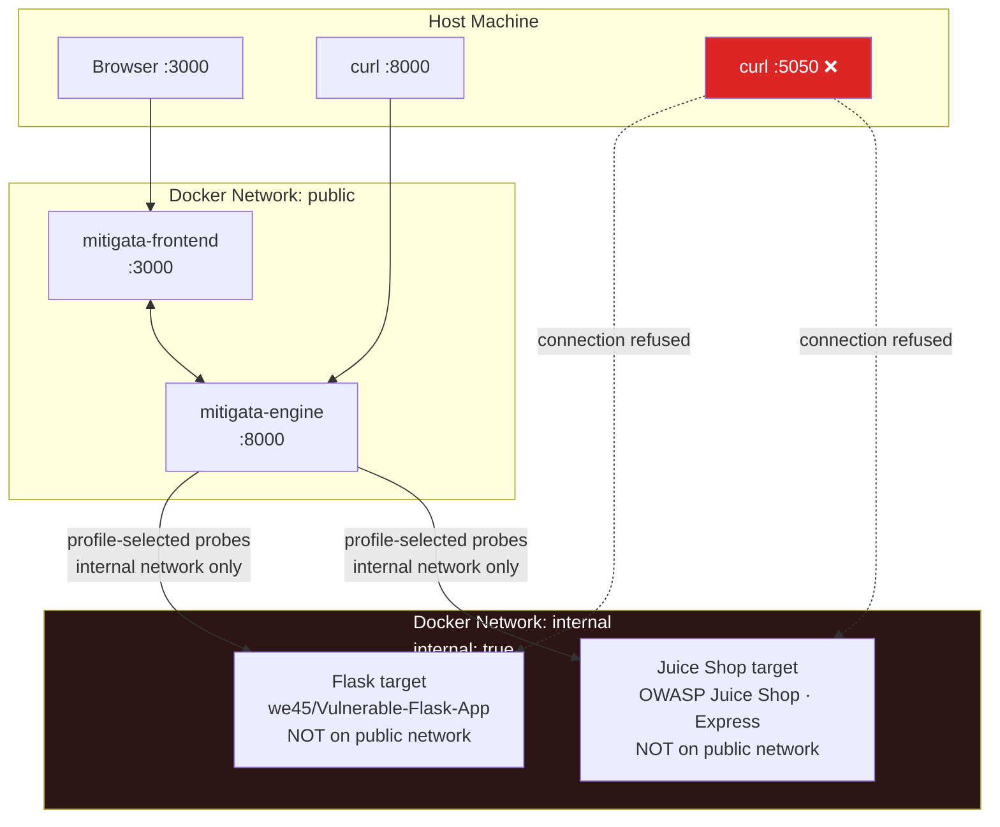
```mermaid
graph TB
    subgraph HOST["Host Machine"]
        B["Browser :3000"]
        C["curl :8000"]
        X["curl :5050 ❌"]
    end

    subgraph PUB["Docker Network: public"]
        FE["mitigata-frontend\n:3000"]
        ENG["mitigata-engine\n:8000"]
    end

    subgraph INT["Docker Network: internal\ninternal: true"]
        FLASK["Flask target\nwe45/Vulnerable-Flask-App\nNOT on public network"]
        JUICE["Juice Shop target\nOWASP Juice Shop · Express\nNOT on public network"]
    end

    B --> FE
    C --> ENG
    X -. "connection refused" .-> FLASK
    X -. "connection refused" .-> JUICE
    FE <--> ENG
    ENG -->|"profile-selected probes\ninternal network only"| FLASK
    ENG -->|"profile-selected probes\ninternal network only"| JUICE

    style INT fill:#2d1515,color:#fff
    style X fill:#dc2626,color:#fff
```

**Probe route:** `engine (internal) → selected target (internal)` — never leaves Docker network. Target profile selection determines both the target origin and the matching read-only source mount; the engine must not fall back to an arbitrary host or combine results across profiles.

---

## 6. Data Schemas

### 6.1 UnifiedFinding — FR-3 Common Format

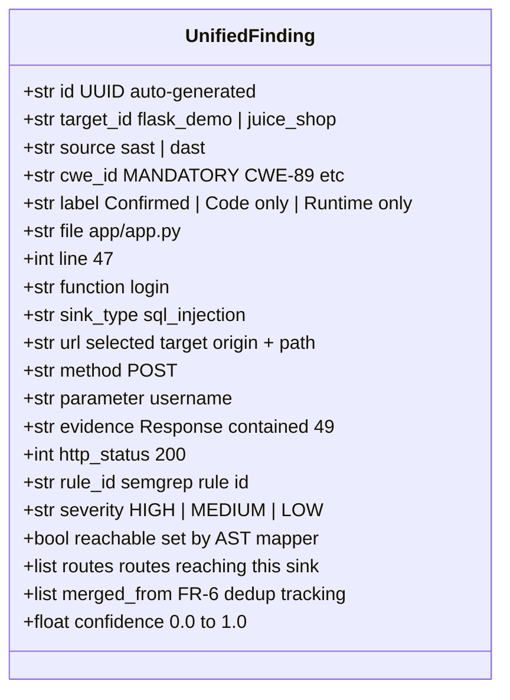
```mermaid
classDiagram
    class UnifiedFinding {
        +str id  UUID auto-generated
        +str target_id  flask_demo | juice_shop
        +str source  sast | dast
        +str cwe_id  MANDATORY CWE-89 etc
        +str label  Confirmed | Code only | Runtime only
        +str file  app/app.py
        +int line  47
        +str function  login
        +str sink_type  sql_injection
        +str url  selected target origin + path
        +str method  POST
        +str parameter  username
        +str evidence  Response contained 49
        +int http_status  200
        +str rule_id  semgrep rule id
        +str severity  HIGH | MEDIUM | LOW
        +bool reachable  set by AST mapper
        +list routes  routes reaching this sink
        +list merged_from  FR-6 dedup tracking
        +float confidence  0.0 to 1.0
    }
```

### 6.2 RouteNode — FR-4 Route Mapping

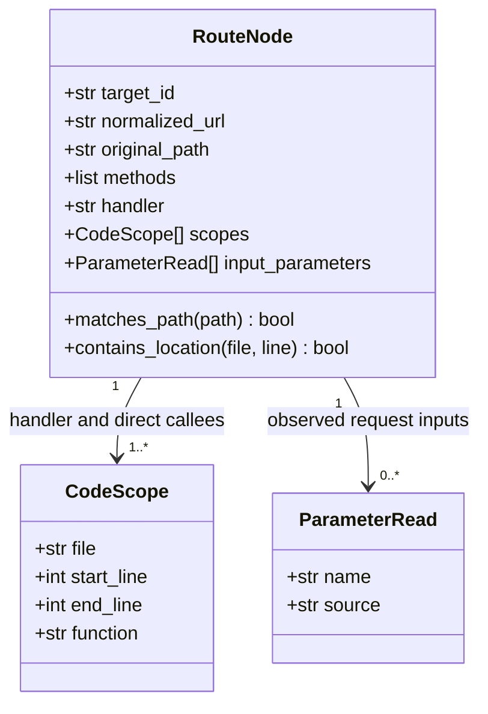
```mermaid
classDiagram
    class RouteNode {
        +str target_id
        +str normalized_url
        +str original_path
        +list methods
        +str handler
        +CodeScope[] scopes
        +ParameterRead[] input_parameters
        +matches_path(path) bool
        +contains_location(file, line) bool
    }

    class CodeScope {
        +str file
        +int start_line
        +int end_line
        +str function
    }

    class ParameterRead {
        +str name
        +str source
    }

    RouteNode "1" --> "1..*" CodeScope : handler and direct callees
    RouteNode "1" --> "0..*" ParameterRead : observed request inputs
```

### 6.3 AlertState — LangGraph

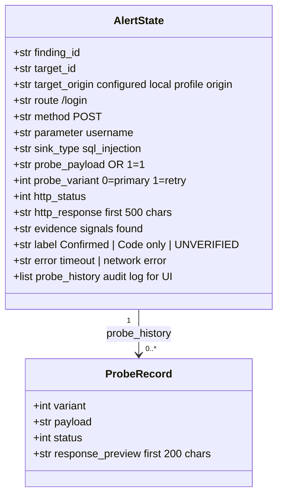
```mermaid
classDiagram
    class AlertState {
        +str finding_id
        +str target_id
        +str target_origin  configured local profile origin
        +str route  /login
        +str method  POST
        +str parameter  username
        +str sink_type  sql_injection
        +str probe_payload  OR 1=1
        +int probe_variant  0=primary 1=retry
        +int http_status
        +str http_response  first 500 chars
        +str evidence  signals found
        +str label  Confirmed | Code only | UNVERIFIED
        +str error  timeout | network error
        +list probe_history  audit log for UI
    }

    class ProbeRecord {
        +int variant
        +str payload
        +int status
        +str response_preview  first 200 chars
    }

    AlertState "1" --> "0..*" ProbeRecord : probe_history
```

### 6.4 GraphResponse — API

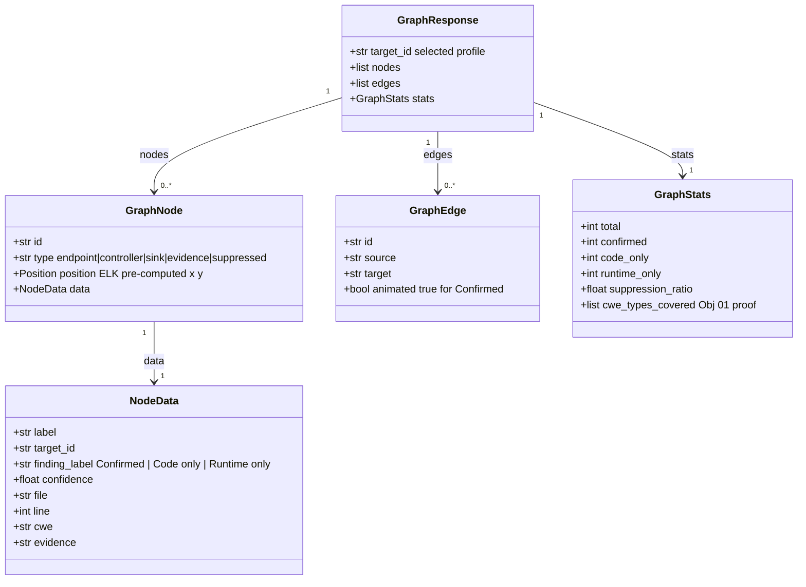
```mermaid
classDiagram
    class GraphResponse {
        +str target_id  selected profile
        +list nodes
        +list edges
        +GraphStats stats
    }

    class GraphNode {
        +str id
        +str type  endpoint|controller|sink|evidence|suppressed
        +Position position  ELK pre-computed x y
        +NodeData data
    }

    class NodeData {
        +str label
        +str target_id
        +str finding_label  Confirmed | Code only | Runtime only
        +float confidence
        +str file
        +int line
        +str cwe
        +str evidence
    }

    class GraphEdge {
        +str id
        +str source
        +str target
        +bool animated  true for Confirmed
    }

    class GraphStats {
        +int total
        +int confirmed
        +int code_only
        +int runtime_only
        +float suppression_ratio
        +list cwe_types_covered  Obj 01 proof
    }

    GraphResponse "1" --> "0..*" GraphNode : nodes
    GraphResponse "1" --> "0..*" GraphEdge : edges
    GraphResponse "1" --> "1" GraphStats : stats
    GraphNode "1" --> "1" NodeData : data
```

---

## 7. API Contract

```mermaid
graph LR
    subgraph ENDPOINTS["FastAPI Endpoints"]
        E1["GET /api/graph?target_id=...\nprofile-scoped · ≤10s · cached 10s TTL"]
        E2["POST /api/verify/{id}\nfinding target_id selects profile\nSSE stream · ≤2s/probe"]
        E3["GET /api/verify/{id}/stream\nEventSource endpoint"]
        E4["POST /api/patch/{id}\nselected-target source · ≤15s"]
        E5["POST /api/patch/{id}/apply\nprofile-scoped git apply + re-verify"]
        E6["GET /api/compliance/{id}\n<200ms · dict lookup"]
        E7["GET /api/findings?target_id=...\nprofile-scoped · Confirmed first"]
        E8["GET /api/findings/{id}\nFR-8 detail includes target_id"]
        E9["GET /api/export/sarif\nB-6 SARIF export"]
        E10["GET /health\nDocker healthcheck"]
        E11["GET /docs\nSwagger UI"]
    end
```

**SSE Event Format:**
```json
// Intermediate:
{"label": "Code only", "probe_history": [...], "done": false}
// Final:
{"label": "Confirmed", "evidence": "['49']", "probe_history": [...], "done": true}
```

---

## 8. Answer Key Mapping

How our architecture maps to the 36 planted vulnerabilities judges score against:

```mermaid
graph TD
    subgraph AK["Flask fixture answer key (36 planted)"]
        P20["20 Code+Runtime Pairs\nConfirmed candidates"]
        P10["10 Code only\ne.g. hardcoded secrets"]
        P6["6 Runtime only\ne.g. missing headers"]
        P8["~8 Safe Decoys\nparameterised queries\nshould NOT be reported"]
    end

    subgraph HOW["How We Hit Each"]
        H20["target_id + CWE + normalized route\n+ method/source when known\n+ code scope + attacked parameter\n→ Confirmed label"]
        H10["SAST only, no DAST match\n→ Code only label\nFR-7 classification"]
        H6["DAST only, no SAST match\n→ Runtime only label\nFR-7 classification"]
        H8["AST reachability check\nparameterised query detection\nB-2 noise cut\nNOT reported"]
    end

    subgraph TARGETS["Performance Targets"]
        T1["Correct links > 50% Good\n> 80% Great\nreport metrics per target profile"]
        T2["Wrong links < 20% Good\n< 5% Great\nAST gates false merges"]
        T3["False alarms < 30% Good\n< 10% Great\nB-2 suppresses safe decoys"]
        T4["Code detection > 60% Good\n> 85% Great\nSemgrep multi-config"]
        T5["Runtime detection > 50% Good\n> 80% Great\nZAP all 30 routes"]
    end

    P20 --> H20 --> T1
    P10 --> H10 --> T2
    P6 --> H6 --> T3
    P8 --> H8 --> T3
    H20 --> T4
    H20 --> T5
```

---

## 9. Performance Budget

```mermaid
gantt
    title Operation Timing Budget
    dateFormat  X
    axisFormat  %ss

    section Startup
    docker compose up --build    :0, 60
    Target healthcheck           :0, 30

    section API (cold)
    GET /api/graph (cold)        :crit, 0, 10
    GET /api/graph (warm/cached) :0, 1

    section LangGraph Probes
    Single probe (hard limit)    :crit, 0, 2
    Probe + retry (2 attempts)   :0, 4

    section UI
    Initial render               :crit, 0, 3
    Node click → detail          :0, 1

    section Patch
    GLM-5.3 patch generation    :0, 10
    Template patch (fallback)    :0, 1
    git apply + re-verify        :0, 3
    Total patch + re-verify      :crit, 0, 15

    section Compliance
    Compliance report            :0, 1
```

| Operation | Budget | Implementation |
|---|---|---|
| `docker compose up --build` | < 60s | cached layers after first run |
| Target healthcheck | < 30s | curl retry 3× with 10s gap |
| `GET /api/graph` (cold) | **≤ 10s** | AST parse + ELK layout |
| `GET /api/graph` (warm) | < 1s | in-memory cache |
| Single LangGraph probe | **≤ 2s** | `httpx timeout=2.0` |
| Probe + retry | ≤ 4s | 2 × 2s probes |
| UI initial render | **≤ 3s** | pre-computed ELK positions |
| Patch generation (GLM-5.3) | ≤ 10s | 10s timeout on LLM |
| Patch generation (template) | < 50ms | dict lookup |
| Total patch + re-verify | **≤ 15s** | within PRD budget |
| Full scan + report | **< 5 min** | pre-seeded data + targeted probes |

---

## 10. Dependency Graph

```mermaid
graph TD
    subgraph ENGINE["engine/"]
        MAIN["api/main.py\nFastAPI app"]

        subgraph ING["ingestion/"]
            SCHEMA["schema.py\nUnifiedFinding\nPydantic v2"]
            SP["semgrep_parser.py"]
            ZP["zap_parser.py"]
            CORR["correlator.py\ntarget + CWE + route + scope + parameter\nFR-5 FR-6"]
        end

        subgraph AST["ast_mapper/ + adapters/"]
            RS["route_schema.py\nRouteNode · CodeScope · ParameterRead"]
            RE["Flask + Express adapters\nFR-4\nPython ast + Node.js AST"]
            SD["sink_detector.py\nstdlib: ast"]
            CG["call_graph.py\none-hop helper scopes\nrequest parameter reads"]
            MG["merger.py\nAST enrichment"]
        end

        subgraph LGM["langgraph_loop/"]
            ST["state.py\nAlertState TypedDict"]
            ND["nodes.py\nhttpx, os"]
            GR["graph.py\nStateGraph"]
        end

        CLF["classifier/classifier.py\nstdlib only"]

        subgraph PCH["patch_engine/"]
            LP["llm_patcher.py\nopenai, os"]
            TP["templates.py\nstdlib only"]
            PA["patcher.py\nsubprocess, git"]
        end

        subgraph CMP["compliance/"]
            RC["risk_calculator.py\nstdlib only"]
            CM["mapping.py\nstdlib only"]
        end
    end

    MAIN --> SP & ZP & CORR
    MAIN --> CG & MG
    MAIN --> GR
    MAIN --> CLF
    MAIN --> PA
    MAIN --> CM

    SP --> SCHEMA
    ZP --> SCHEMA
    CORR --> SCHEMA
    MG --> SCHEMA
    CG --> RE & SD & RS
    RE --> RS
    GR --> ST & ND
    PA --> LP & TP
    CM --> RC

    subgraph FRONTEND["frontend/src/"]
        APP["App.tsx"]
        CGRAPH["CorrelationGraph.tsx\n@xyflow/react · elkjs"]
        FDP["FindingDetailPanel.tsx"]
        BRP["BusinessRiskPanel.tsx"]
        RTB["ReTestButton.tsx"]
        HOOKS["hooks/\nuseVerification SSE\nusePatch"]
    end

    APP --> CGRAPH & FDP & BRP & RTB
    FDP --> HOOKS
    RTB --> HOOKS

    subgraph DEPS["Python deps"]
        FASTAPI["fastapi · uvicorn"]
        PYDANTIC["pydantic>=2"]
        HTTPX["httpx"]
        LG_DEP["langgraph"]
        OAI["openai (optional)"]
    end

    MAIN --- FASTAPI
    SCHEMA --- PYDANTIC
    ND --- HTTPX
    GR --- LG_DEP
    LP --- OAI
```

**Objective-to-Component Mapping:**

```mermaid
graph LR
    subgraph OBJ["Objectives → Components"]
        O1["Objective 01\nFR-1 FR-2 FR-3"] --> C1["semgrep_parser\nzap_parser\nschema UnifiedFinding"]
        O2["Objective 02\nFR-4 FR-5 FR-6"] --> C2["three-pass Flask/Express route adapters FR-4\ncorrelator: target + CWE + route + scope + parameter\nmethod/source when available · FR-5 FR-6 dedup"]
        O3["Objective 03\nFR-7 FR-8 FR-9"] --> C3["classifier\nlanggraph_loop B-1\nFindingDetailPanel FR-8\ncorrelator sort FR-9"]
    end
```

---

*Architecture version: 1.3 — Mitigata Hackathon Problem 06 (Flagship); Flask + Express multi-target architecture*
*All diagrams use Mermaid — renders natively in GitHub, GitLab, VS Code with Markdown Preview Enhanced, and Obsidian*  
*Reference: [P06-PRD.md](P06-PRD.md) · [P06-SAST-DAST-Correlation-Engine.md](P06-SAST-DAST-Correlation-Engine.md) · [P06-Build-Plan.md](P06-Build-Plan.md)*
